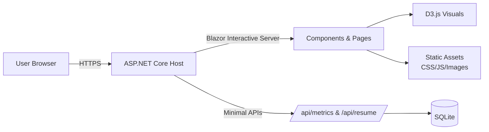

<div align="center">

# Justin Palmer — Personal Site

**Software Engineering • Data/Cloud Platforms • Production‑ready delivery**


[Live site](https://justinraypalmer.com) • [GitHub profile](https://github.com/JustinPsHub)

</div>

This repo is my public portfolio and the primary showcase of how I build software products and data/cloud platforms. It is intentionally production‑minded: clean UI/UX, structured content, API‑backed data, and interactive visuals.

## Why this exists
Most of my professional work is in federal environments behind a firewall, so I cannot share those projects publicly. This site is the open, end-to-end artifact that demonstrates how I design, build, and ship software in a real-world setting.

## Highlights


- Dual‑track positioning: software engineering + data/cloud platform engineering
- Blazor Interactive Server with reusable components and responsive layout
- API‑backed data and seeded telemetry for dashboards
- D3 visualizations with filters and deterministic redraws
- Production‑minded runtime: output caching, rate limiting, security headers
- Resume page is fully web‑based (no phone number shown)

## Tech stack


- .NET 9 (ASP.NET Core)
- Blazor (Interactive Server + optional WebAssembly components)
- EF Core + SQLite (seeded data)
- D3.js for charts and dashboards
- Bootstrap 5 for layout and UI utilities
- Application Insights (optional)

## Local setup
Prerequisites:
- .NET 9 SDK

Run locally:
```bash
# from repo root

dotnet restore

dotnet run --project MyPersonalSite
```
The app will print the local URL in the console (typically https://localhost:xxxx).

## Data & confidentiality
- Resume and site data is seeded into a local SQLite database on startup.
- Visuals use seeded/mock telemetry to mimic real-world signals.
- Metrics and outcomes are anonymized/aggregated due to federal confidentiality restrictions.

## Architecture overview


## Data inputs & outputs
```mermaid
flowchart TB
    Seed[Seeded Data (DbInitializer)] --> Db[(SQLite)]
    Db --> Resume[Resume Page]
    Db --> Visuals[Visuals Page]
    Visuals --> D3[D3 Charts]
    Resume --> Export[Export (Word/PDF if present)]
    UI[Blazor UI] --> User[Hiring Manager / Bot]
```

## Project structure
- MyPersonalSite/ - Server host (ASP.NET Core + Blazor)
- MyPersonalSite.Client/ - Client project (WebAssembly components)
- MyPersonalSite.Shared/ - Shared DTOs and models
- MyPersonalSite/Components/ - UI pages and layout
- MyPersonalSite/wwwroot/ - Static assets, CSS, JS (including D3)

## Notable pages
- / - Overview and impact summary
- /visuals - Interactive dashboards (seeded telemetry)
- /platform - Architecture and delivery approach
- /resume - Resume content with export options

## Layout note
- Avoid `MyPersonalSite/Components/Layout/MainLayout.razor.css`. It can override the global layout and cause the main content to stack under the left nav. Keep layout rules centralized in `MyPersonalSite/wwwroot/app.css`.

## Contact
- Email: justinraypalmer@gmail.com
- GitHub: https://github.com/JustinPsHub/MyPersonalSite
